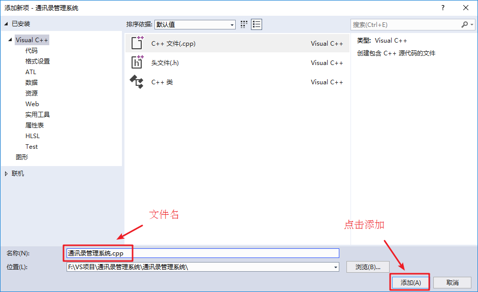
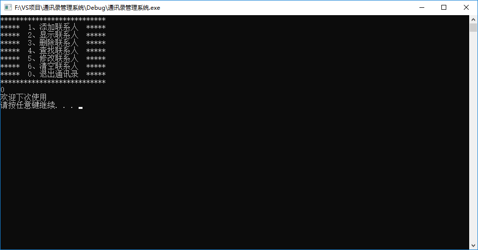
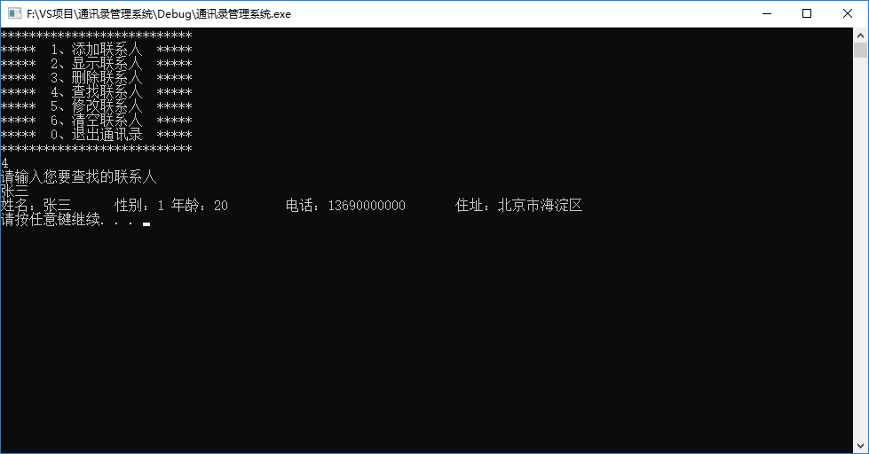

# 通讯录管理系统


## 1、系统需求

通讯录是一个可以记录亲人、好友信息的工具。

本教程主要利用C++来实现一个通讯录管理系统

系统中需要实现的功能如下：

* 添加联系人：向通讯录中添加新人，信息包括（姓名、性别、年龄、联系电话、家庭住址）最多记录1000人
* 显示联系人：显示通讯录中所有联系人信息
* 删除联系人：按照姓名进行删除指定联系人
* 查找联系人：按照姓名查看指定联系人信息
* 修改联系人：按照姓名重新修改指定联系人
* 清空联系人：清空通讯录中所有信息
* 退出通讯录：退出当前使用的通讯录


## 2、创建项目

创建项目步骤如下：

* 创建新项目
* 添加文件

### 2.1 创建项目

打开vs2017后，点击创建新项目，创建新的C++项目


填写项目名称，选择项目路径


### 2.2添加文件




添加成功后，效果如图：


至此，项目已创建完毕


## 3、菜单功能

**功能描述：** 用户选择功能的界面

菜单界面效果如下图：


**步骤：**

* 封装函数显示该界面  如 `void showMenu()`
* 在main函数中调用封装好的函数


**代码：**

```C++
#include<iostream>
using namespace std;

//菜单界面
void showMenu()
{
	cout << "***************************" << endl;
	cout << "*****  1、添加联系人  *****" << endl;
	cout << "*****  2、显示联系人  *****" << endl;
	cout << "*****  3、删除联系人  *****" << endl;
	cout << "*****  4、查找联系人  *****" << endl;
	cout << "*****  5、修改联系人  *****" << endl;
	cout << "*****  6、清空联系人  *****" << endl;
	cout << "*****  0、退出通讯录  *****" << endl;
	cout << "***************************" << endl;
}

int main() {

	showMenu();

	system("pause");

	return 0;
}
```


## 4、退出功能

功能描述：退出通讯录系统


思路：根据用户不同的选择，进入不同的功能，可以选择switch分支结构，将整个架构进行搭建


当用户选择0时候，执行退出，选择其他先不做操作，也不会退出程序


**代码：**

```C++
int main() {

	int select = 0;

	while (true)
	{
		showMenu();

		cin >> select;
		
		switch (select)
		{
		case 1:  //添加联系人
			break;
		case 2:  //显示联系人
			break;
		case 3:  //删除联系人
			break;
		case 4:  //查找联系人
			break;
		case 5:  //修改联系人
			break;
		case 6:  //清空联系人
			break;
		case 0:  //退出通讯录
			cout << "欢迎下次使用" << endl;
			system("pause");
			return 0;
			break;
		default:
			break;
		}
	}

	system("pause");

	return 0;
}
```


效果图：




## 5、添加联系人

功能描述：

实现添加联系人功能，联系人上限为1000人，联系人信息包括（姓名、性别、年龄、联系电话、家庭住址）


添加联系人实现步骤：

* 设计联系人结构体
* 设计通讯录结构体
* main函数中创建通讯录
* 封装添加联系人函数
* 测试添加联系人功能


### 5.1 设计联系人结构体

联系人信息包括：姓名、性别、年龄、联系电话、家庭住址

设计如下：

```C++
#include <string>  //string头文件
//联系人结构体
struct Person
{
	string m_Name; //姓名
	int m_Sex; //性别：1男 2女
	int m_Age; //年龄
	string m_Phone; //电话
	string m_Addr; //住址
};
```


### 5.2 设计通讯录结构体

设计时候可以在通讯录结构体中，维护一个容量为1000的存放联系人的数组，并记录当前通讯录中联系人数量

设计如下

```C++
#define MAX 1000 //最大人数

//通讯录结构体
struct Addressbooks
{
	struct Person personArray[MAX]; //通讯录中保存的联系人数组
	int m_Size; //通讯录中人员个数
};
```


### 5.3 main函数中创建通讯录


添加联系人函数封装好后，在main函数中创建一个通讯录变量，这个就是我们需要一直维护的通讯录


```c++
mian函数起始位置添加：

	//创建通讯录
	Addressbooks abs;
	//初始化通讯录中人数
	abs.m_Size = 0;
```


### 5.4 封装添加联系人函数


思路：添加联系人前先判断通讯录是否已满，如果满了就不再添加，未满情况将新联系人信息逐个加入到通讯录


添加联系人代码：


```C++
//1、添加联系人信息
void addPerson(Addressbooks *abs)
{
	//判断电话本是否满了
	if (abs->m_Size == MAX)
	{
		cout << "通讯录已满，无法添加" << endl;
		return;
	}
	else
	{
		//姓名
		string name;
		cout << "请输入姓名：" << endl;
		cin >> name;
		abs->personArray[abs->m_Size].m_Name = name;//very good good

		cout << "请输入性别：" << endl;
		cout << "1 -- 男" << endl;
		cout << "2 -- 女" << endl;

		//性别
		int sex = 0;
		while (true)
		{
			cin >> sex;
			if (sex == 1 || sex == 2)
			{
				abs->personArray[abs->m_Size].m_Sex = sex;
				break;
			}
			cout << "输入有误，请重新输入";
		}

		//年龄
		cout << "请输入年龄：" << endl;
		int age = 0;
		cin >> age;
		abs->personArray[abs->m_Size].m_Age = age;

		//联系电话
		cout << "请输入联系电话：" << endl;
		string phone = "";
		cin >> phone;
		abs->personArray[abs->m_Size].m_Phone = phone;

		//家庭住址
		cout << "请输入家庭住址：" << endl;
		string address;
		cin >> address;
		abs->personArray[abs->m_Size].m_Addr = address;

		//更新通讯录人数
		abs->m_Size++;

		cout << "添加成功" << endl;
		system("pause");
		system("cls");
	}
}
```


### 5.5 测试添加联系人功能

选择界面中，如果玩家选择了1，代表添加联系人，我们可以测试下该功能


在switch case 语句中，case1里添加：

```C++
case 1:  //添加联系人
	addPerson(&abs);
	break;
```


测试效果如图：


## 6、显示联系人

功能描述：显示通讯录中已有的联系人信息


显示联系人实现步骤：

* 封装显示联系人函数
* 测试显示联系人功能

### 6.1 封装显示联系人函数


思路：判断如果当前通讯录中没有人员，就提示记录为空，人数大于0，显示通讯录中信息


显示联系人代码：

```C++
//2、显示所有联系人信息
void showPerson(Addressbooks * abs)
{
	if (abs->m_Size == 0)
	{
		cout << "当前记录为空" << endl;
	}
	else
	{
		for (int i = 0; i < abs->m_Size; i++)
		{
			cout << "姓名：" << abs->personArray[i].m_Name << "\t";
			cout << "性别：" << (abs->personArray[i].m_Sex == 1 ? "男" : "女") << "\t";
			cout << "年龄：" << abs->personArray[i].m_Age << "\t";
			cout << "电话：" << abs->personArray[i].m_Phone << "\t";
			cout << "住址：" << abs->personArray[i].m_Addr << endl;
		}
	}
	
	system("pause");
	system("cls");

}
```


### 6.2 测试显示联系人功能


在switch case语句中，case 2 里添加

```C++
case 2:  //显示联系人
	showPerson(&abs);
	break;
```


测试效果如图：


## 7、删除联系人

功能描述：按照姓名进行删除指定联系人


删除联系人实现步骤：

* 封装检测联系人是否存在
* 封装删除联系人函数
* 测试删除联系人功能


### 7.1  封装检测联系人是否存在

设计思路：


删除联系人前，我们需要先判断用户输入的联系人是否存在，如果存在删除，不存在提示用户没有要删除的联系人

因此我们可以把检测联系人是否存在封装成一个函数中，如果存在，返回联系人在通讯录中的位置，不存在返回-1


检测联系人是否存在代码：

```C++
//判断是否存在查询的人员，存在返回在数组中索引位置，不存在返回-1
int isExist(Addressbooks * abs, string name)
{
	for (int i = 0; i < abs->m_Size; i++)
	{
		if (abs->personArray[i].m_Name == name)
		{
			return i;
		}
	}
	return -1;
}

```


### 7.2 封装删除联系人函数


根据用户输入的联系人判断该通讯录中是否有此人

查找到进行删除，并提示删除成功

查不到提示查无此人。


```C++
//3、删除指定联系人信息
void deletePerson(Addressbooks * abs)
{
	cout << "请输入您要删除的联系人" << endl;
	string name;
	cin >> name;

	int ret = isExist(abs, name);
	if (ret != -1)
	{
		for (int i = ret; i < abs->m_Size; i++)
		{
			abs->personArray[i] = abs->personArray[i + 1];
		}
         abs->m_Size--;
		cout << "删除成功" << endl;
	}
	else
	{
		cout << "查无此人" << endl;
	}

	system("pause");
	system("cls");
}
```


### 7.3 测试删除联系人功能

在switch case 语句中，case3里添加：

```C++
case 3:  //删除联系人
	deletePerson(&abs);
	break;
```

测试效果如图：

存在情况：


不存在情况：


## 8、查找联系人

功能描述：按照姓名查看指定联系人信息

查找联系人实现步骤

* 封装查找联系人函数
* 测试查找指定联系人

### 8.1 封装查找联系人函数

实现思路：判断用户指定的联系人是否存在，如果存在显示信息，不存在则提示查无此人。

查找联系人代码：

```C++
//4、查找指定联系人信息
void findPerson(Addressbooks * abs)
{
	cout << "请输入您要查找的联系人" << endl;
	string name;
	cin >> name;

	int ret = isExist(abs, name);
	if (ret != -1)
	{
		cout << "姓名：" << abs->personArray[ret].m_Name << "\t";
		cout << "性别：" << abs->personArray[ret].m_Sex << "\t";
		cout << "年龄：" << abs->personArray[ret].m_Age << "\t";
		cout << "电话：" << abs->personArray[ret].m_Phone << "\t";
		cout << "住址：" << abs->personArray[ret].m_Addr << endl;
	}
	else
	{
		cout << "查无此人" << endl;
	}

	system("pause");
	system("cls");

}
```


### 8.2 测试查找指定联系人

在switch case 语句中，case4里添加：

```C++
case 4:  //查找联系人
	findPerson(&abs);
	break;
```


测试效果如图

存在情况：




不存在情况：


## 9、修改联系人

功能描述：按照姓名重新修改指定联系人

修改联系人实现步骤

* 封装修改联系人函数
* 测试修改联系人功能


### 9.1 封装修改联系人函数

实现思路：查找用户输入的联系人，如果查找成功进行修改操作，查找失败提示查无此人


修改联系人代码：

```C++
//5、修改指定联系人信息
void modifyPerson(Addressbooks * abs)
{
	cout << "请输入您要修改的联系人" << endl;
	string name;
	cin >> name;

	int ret = isExist(abs, name);
	if (ret != -1)
	{
		//姓名
		string name;
		cout << "请输入姓名：" << endl;
		cin >> name;
		abs->personArray[ret].m_Name = name;

		cout << "请输入性别：" << endl;
		cout << "1 -- 男" << endl;
		cout << "2 -- 女" << endl;

		//性别
		int sex = 0;
		while (true)
		{
			cin >> sex;
			if (sex == 1 || sex == 2)
			{
				abs->personArray[ret].m_Sex = sex;
				break;
			}
			cout << "输入有误，请重新输入";
		}

		//年龄
		cout << "请输入年龄：" << endl;
		int age = 0;
		cin >> age;
		abs->personArray[ret].m_Age = age;

		//联系电话
		cout << "请输入联系电话：" << endl;
		string phone = "";
		cin >> phone;
		abs->personArray[ret].m_Phone = phone;

		//家庭住址
		cout << "请输入家庭住址：" << endl;
		string address;
		cin >> address;
		abs->personArray[ret].m_Addr = address;

		cout << "修改成功" << endl;
	}
	else
	{
		cout << "查无此人" << endl;
	}

	system("pause");
	system("cls");

}
```


### 9.2 测试修改联系人功能

在switch case 语句中，case 5里添加：

```C++
case 5:  //修改联系人
	modifyPerson(&abs);
	break;
```


测试效果如图：

查不到指定联系人情况：


查找到联系人，并修改成功：


再次查看通讯录，确认修改完毕


## 10、清空联系人

功能描述：清空通讯录中所有信息

清空联系人实现步骤

* 封装清空联系人函数
* 测试清空联系人

### 10.1 封装清空联系人函数

实现思路： 将通讯录所有联系人信息清除掉，只要将通讯录记录的联系人数量置为0，做逻辑清空即可。

清空联系人代码：

```C++
//6、清空所有联系人
void cleanPerson(Addressbooks * abs)
{
	abs->m_Size = 0;
	cout << "通讯录已清空" << endl;
	system("pause");
	system("cls");
}
```


### 10.2  测试清空联系人

在switch case 语句中，case 6 里添加：

```C++
case 6:  //清空联系人
	cleanPerson(&abs);
	break;
```


测试效果如图：

清空通讯录


再次查看信息，显示记录为空


**至此，通讯录管理系统完成！**